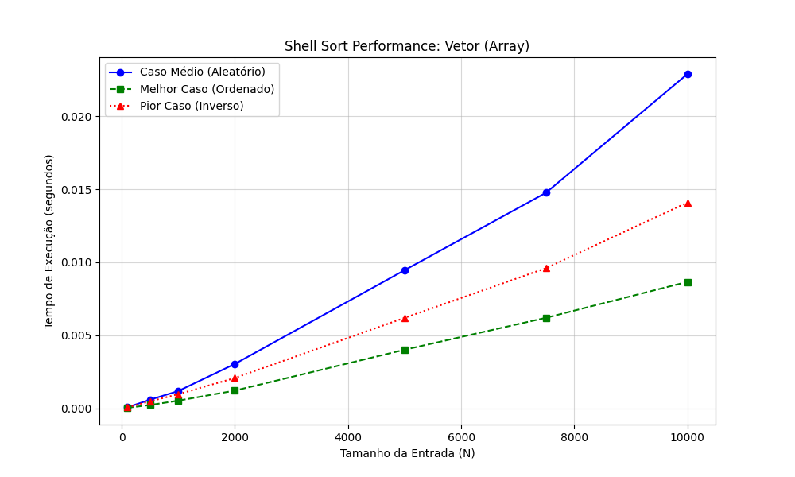

# Shell Sort Implementation

**Grupo 3 — Shell Sort (vetor)**

### Participantes:
- Leonardo Felipe Roncolato
- Ana Clara Nery e Mello Figueiredo
- Maria Clara Rossetti A L Manrique
- Paulo Rocha Lima de Souza
- Laryssa Fernanda Alves Santos
- Pedro Augusto Bandeira Viana
- Guilherme Emanuel Oliveira Guimarães

---

Este repositório contém a implementação e análise de performance do algoritmo **Shell Sort** utilizando vetores (arrays).

## Estrutura Implementada

### Vetor / Array Nativo (`shell_sort_array.py`)
*   **Acesso:** $O(1)$ (Acesso direto por índice).
*   **Performance:** Alta eficiência em memória e tempo.
*   **Testes:** Realizados com até $N=10.000$ elementos.

## Como Executar

Para rodar os testes de performance:
```bash
python performance_analysis.py
```

---

## Análise de Performance e Gráfico

O gráfico abaixo compara o tempo de execução do Shell Sort em três cenários: Melhor Caso (já ordenado), Caso Médio (aleatório) e Pior Caso (inversamente ordenado).



### Observações sobre os dados:
- O algoritmo demonstra excelente escalabilidade para vetores de até $10.000$ elementos.
- Mesmo no pior caso, o tempo de execução permanece extremamente baixo devido à eficiência das trocas com gaps.

## Análise de Complexidade Assintótica

O Shell Sort é uma melhoria do *Insertion Sort* que permite a troca de elementos distantes, reduzindo drasticamente o número de movimentações necessárias.

- **Complexidade de Espaço:** $O(1)$ - O algoritmo é *in-place*, não exigindo memória extra proporcional à entrada.
- **Complexidade de Tempo:** 
    - Depende diretamente da **sequência de gaps** escolhida.
    - Na implementação atual (sequência de Shell: $N/2, N/4, \dots, 1$), o pior caso teórico é **$O(N^2)$**.
    - No entanto, para distribuições aleatórias e tamanhos práticos de $N$, o desempenho se aproxima de complexidades sub-quadráticas.

## Conclusão
O uso de vetores é a escolha ideal para o Shell Sort, pois o algoritmo depende fundamentalmente do acesso rápido a elementos distantes no conjunto de dados. A estrutura de vetor permite que esses "saltos" ocorram em tempo constante ($O(1)$), garantindo a eficiência do método.

---
